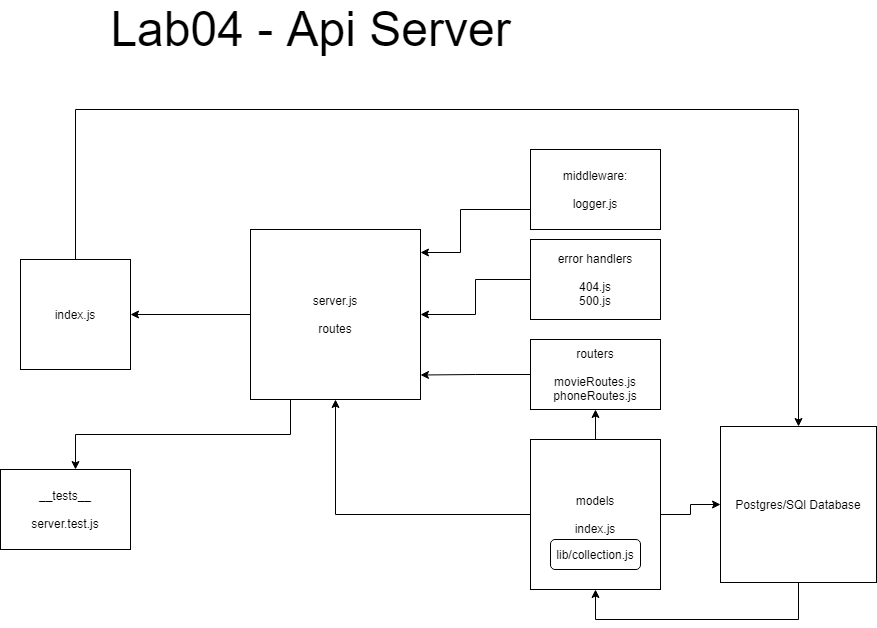

# 401-JS Lab4: Data Modeling

## Description

Dynamic API Phase 3: Add Database Abstraction and Associations to your API

## Author

Ayrat Gimranov

## Collaborators

Alex White (instructor)

## Version

1.0.0

## Resources

Code Feloows 401: JS demo code (Lab 4) - <https://github.com/codefellows/seattle-javascript-401n19/tree/main/class-04/demo/class_4_demo>

## Deployed Sites

Prod branch -- https://ayrat-server-prod.herokuapp.com/
Dev branch -- https://ayrat-server-dev.herokuapp.com/

## UML

;